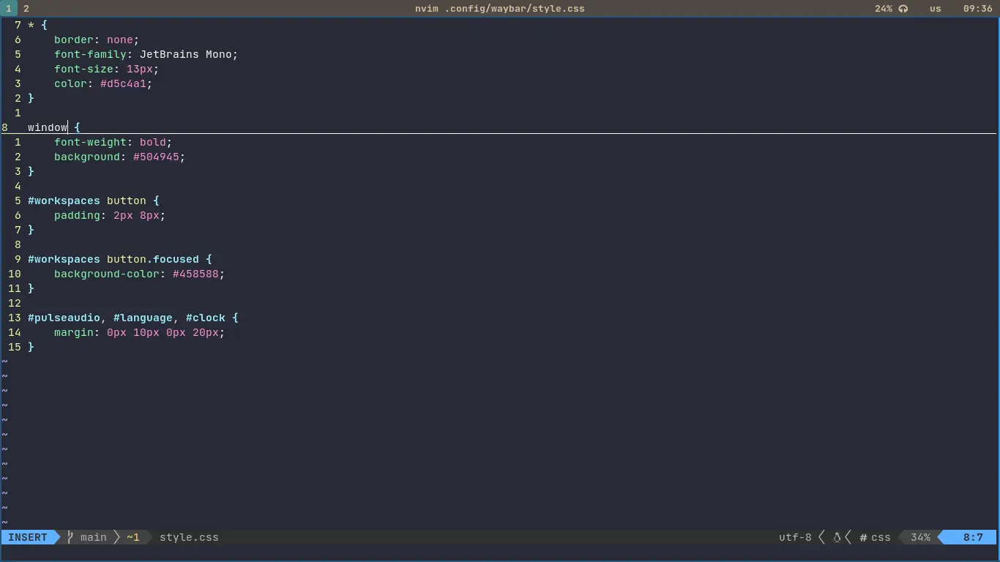

# .files

## Getting started
```sh
git clone git@github.com:ordinary-dev/dotfiles.git ~/.dotfiles
cd ~/.dotfiles
./setup.sh
```

## Screenshots


## List of required programs
* `sway` - window manager
* `waybar` - status bar
* `mako` - notifications

* `grim` and `slurp` - screenshots
* `wofi` - application launcher

* `pactl` - volume control
* `brightnessctl` - brightness control
* `playerctl` - player control

* `zsh` - shell
* `alacritty` - terminal emulator

* `neovim` - text editor
* `mpv` - media player
